# Excel Tips and Tricks
This exercise will teach you a few of the most useful tips for data manipulation and cleaning in Excel. 

## ⤵️Step 1: Importing Data
One of the most annoying and detrimental features of Excel is how much it **loves** to convert data, especially fractions (➗), into dates (📅).

I've saved our test dataset as a `.txt` file to illustrate this.

### 1.1 Download [raw_star_wars.txt](data/raw_star_wars.txt).

Open Excel, select Open 📂, then Browse 📂 and navigate to your Downloads folder.

You will see something that looks like this, and you will ask yourself, "Where is the file that I literally just downloaded?"

You will then go to the dropdown in the bottom right and change it from "All Excel Files" to "All Files"

There it is! 

### 1.2 Import raw_star_wars.txt
Select the file and click Open. 

You'll see an Import Wizard 🪄

#### 1.2.1 Use the defaults for Step 1
The file is Delimited (not Fixed Width).

You *can* check "My data has headers."

#### 1.2.2 Use the defaults for Step 2
We can see now that the file is **Tab**-delimited because the columns are correctly separated when we select **Tab** as the delimiter. 

To prove this, try unchecking **Tab** and selecting one of the other delimiters. 

#### 1.2.3 What happens if we use the defaults for Step 3
I've made a column called `films` with how many films a character has appeared in, out of the original and prequel trilogies.

So Luke Skywalker (who technically appears as a baby in Revenge of the Sith, in addition to all the original movies) is in 4/6 films. 

But Excel has decided that 4/6 = April 6th, 2025:

#### 1.2.4 What to do instead for Step 3
You can see that the default for Column data format is **General**, which automatically converts "date values to dates." 

You might say, why would it assume that 4/6 is a date and not a fraction? To which I say, great question, I have no idea why this is the default. 

The fix is to select the `films` column and change it from **General** to **Text**.

Cells formatted as **Text** are displayed exactly as written.

So select **Text** on Step 3 of the Import Wizard and click Finish.

## 🎨Step 2: Conditional Formatting
There's a lot of fancy stuff you can do with conditional formatting, but I'll teach you the basics.

### 2.1 Highlight Duplicates
Highlight column J, `species`, and select the following Conditional Formatting options:

A useful real-world example is gene expression analysis, where you have two lists of differentially expressed genes and you want to quickly see the overlap. Paste one gene list below the other (separated by a cell) and highlight duplicates.

### 2.2 Highlight Text that contains...
Highlight column I, `homeworld`, select the following Conditional Formatting options, and then type `Kashyyyk` for Chewie's homeworld:

Useful if you have specific text that you want to quickly highlight.

### 2.3 Highlight Values
Highlight column C, `mass`, select the following Conditional Formatting options, and select a range of values:

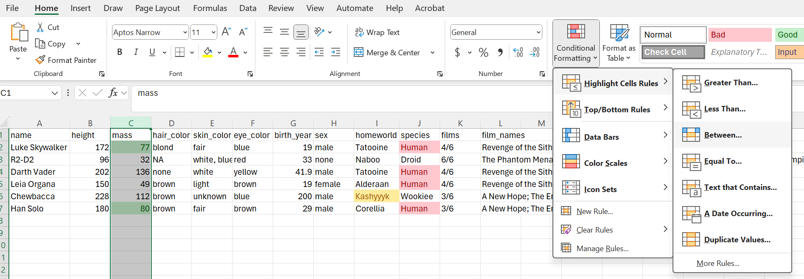

As you can see, you can also select values >, <, or = specific values. Useful to see only significant p-values.

### 2.4 Color Scales
Highlight column B, `height`, select the following Conditional Formatting options, and pick a color pallette:

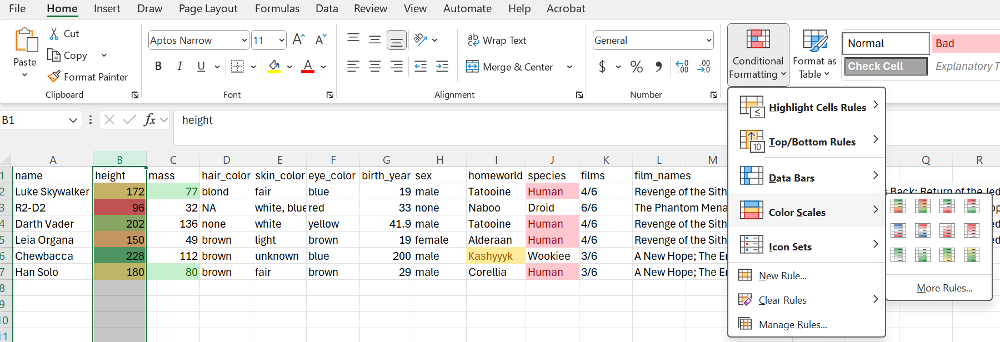

💡Note that the top and bottom of the scales are determined by the largest and smallest values in your data, respectively. 

Look how the colors change if I include `0`:

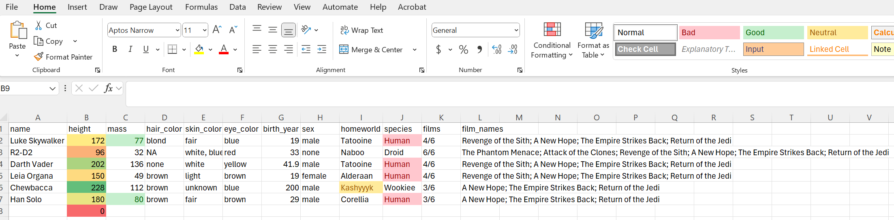

Mostly useful to get a visual sense of the distribution of your data (and it looks pretty). 

## 🗃️Step 3: Filtering
Click on any cell in row 1 and follow the steps below, either on the **Home** tab (left image) or the **Data** tab (right image):

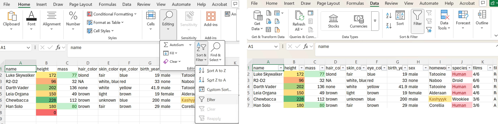

Select the dropdown arrow 🔽 in column H, `sex`, to filter for only the male characters:

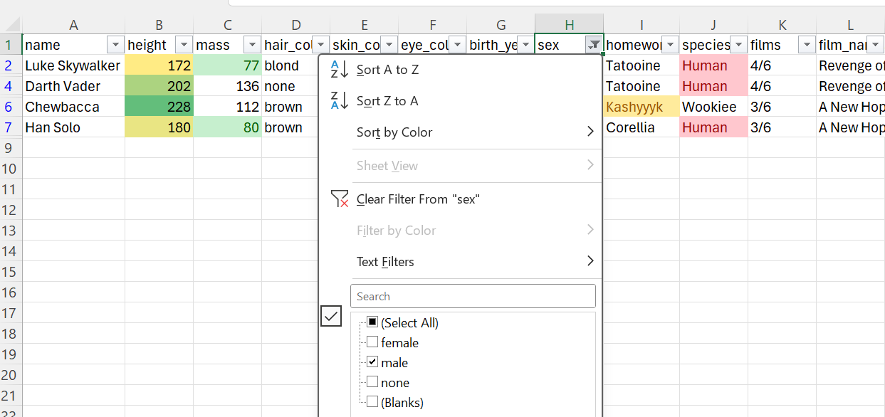

Filtering is an incredibly powerful tool, but it can also be dangerous, especially when filtering multiple variables at the same time. 

Make sure you are always aware of what filters you have on at any given time to make sure you're not inadvertently missing any data. 

## 📊Step 4: Text to Columns
I've listed the names of the films the characters appear in, separated by a semicolon `;`.

If we want to separate out each film into its own cell, we can use the Text to Columns feature.

### 4.1 Text to Columns Wizard
#### 4.1.1 Open Text to Columns Wizard 🪄
Unfilter column H (select the dropdown 🔽 and select "Clear filter from `sex`").

Select column L, `film_names`, and select Text to Columns

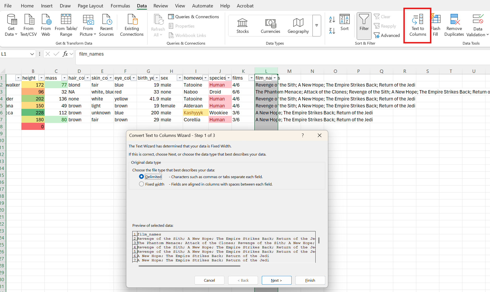

#### 4.1.2 Make sure you select "Delimited" in Step 1
This will look the same as Step 1 of our Data Import Wizard.

#### 4.1.3 Select the appropriate delimiter in Step 2
I separated the films by `;`, so select **Semicolon** under Delimiters:

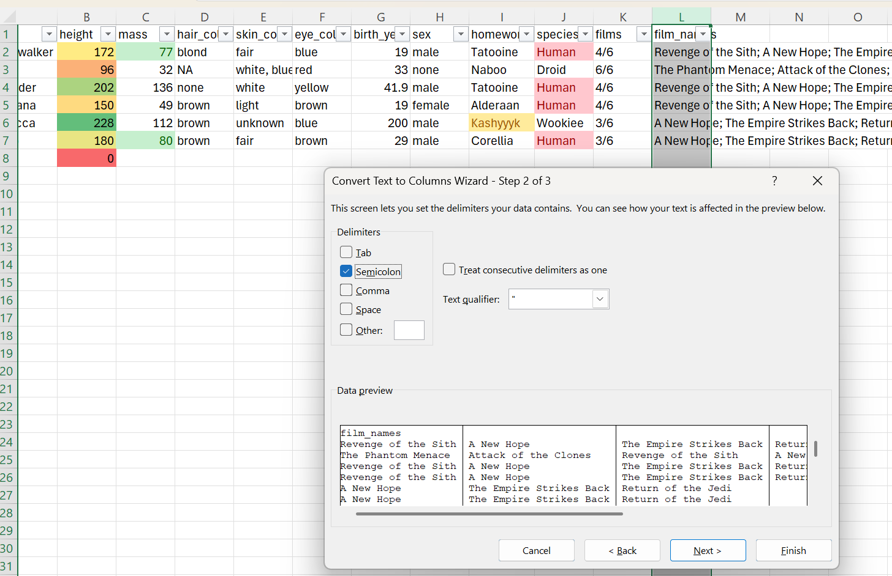

#### 4.1.4 Use the defaults for Step 3
We don't need to change the column data format.

### 4.2 Important Caveats
#### 4.2.1 Column names
You'll notice that our filter only applies to the original `film_names` column. 

It's best to create column headers for each new column we just created.
* If we don't care what they're called, we can mark them with anything (I just use an `x`).
* In this case, I wrote them in order, so the first film listed is the first film the character appears in, and so on.
* So we can name the new columns logically, with `first_film`, `second_film`, etc.

#### 4.2.2 Filtering with empty columns
A helpful way to identify missing data in a dataset is to filter by `(Blanks)`. 

You will need to *reapply* the filter to the newly named columns. Just click **Filter** again.

Select the filtering dropdown 🔽 in column Q, our newly named `sixth_film` column, and filter by `(Blanks)`:

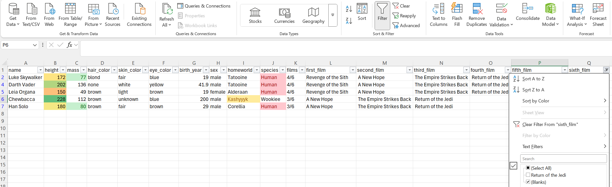

Now we can see which characters do not appear in a sixth film. If we want, we could add `NA` to these blank spaces to indicate that the `sixth_film` variable does not apply to these characters. 

#### 4.2.3 ⚠️ The most important thing about Text to Columns
In an attempt to be helpful, Excel assumes you want to apply your Text to Columns settings to every Excel file you open until you tell it otherwise.

This can cause some very annoying behaviors, especially if your delimiter was something very common, like **Tab** or **Space**, because it will automatically turn text into columns using that delimiter.

Re-set to the defaults by selecting a cell with text, going back to Text to Columns, and unchecking whatever delimiter you used. 

For us, we will uncheck **Semicolon**:

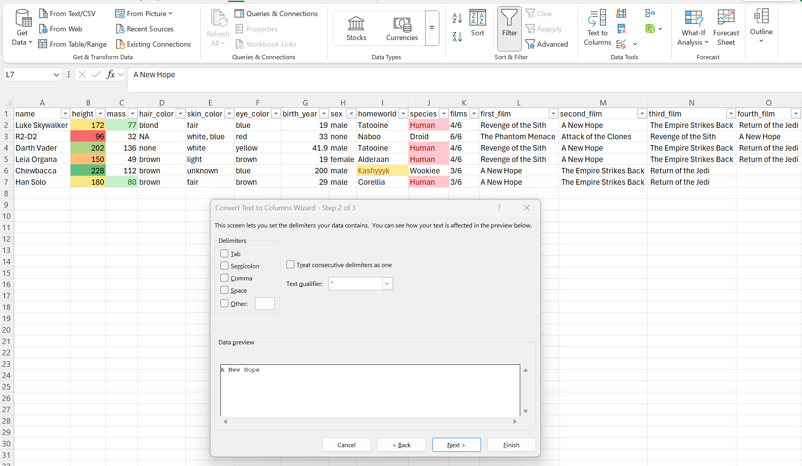

## 📑Step 5: Tabs
Sometimes you need to create an Excel workbook with multiple tabs. This can sometimes keep things organized, but there are a few important things to note regarding tabs and data cleaning.

First, if you don't know how to create one, go to the bottom left corner and click the ➕:

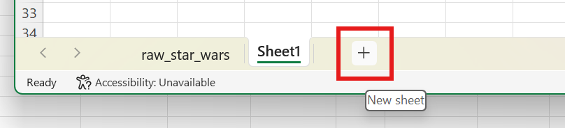

1. It's always good to rename your tabs so you know what is in them and why you created them. Right click and select **Rename**.
2. Most data analysis programs such as R *cannot process multiple tabs within a file*. They will default to reading the first tab of a workbook.
3. This is also true of different file formats. You cannot have a document with multiple tabs if you save it as a `.txt`, `.csv`, or `.tsv` file, for example.
4. If you need to save your data in one of those formats, or if you need to analyze multiple tabs in R, save each tab as a separate Excel file. 

## 💾Step 6: Save as Excel `.xlsx`
This might not deserve its own step, but I can't count how many times I've created a beautiful Excel with lots of conditional formatting and a bunch of tabs, only to not realize that it was still a `.csv` file or something, and saved it without realizing it, losing all my tabs and formatting. 

This has become a bigger issue now that Microsoft Office makes file extensions more difficult to see. (You used to be able to check the file extension at the top of your Excel window, but now it just shows the file name.)

The safest thing to do is to save your file as an Excel `.xlsx` file as soon as you've imported it. 

Do I always remember to do this? No. Should I? Yes. 

Save your workbook, using **💾 Save As**, now. To differentiate it from our raw data, which we should never overwrite, save it with a name like `clean_star_wars.xlsx`.

## 🔀Step 7: Transposing your Data
Sometimes you need to transpose your data so the columns are rows and the rows are columns. 

To illustrate this, I've saved another dataset, [star_wars_homeworlds.xlsx](data/star_wars_homeworlds.xlsx).

### 7.1 Download `star_wars_homeworlds.xlsx`

I've saved this as an `.xlsx` file, so you don't need to worry about importing it; just open it in Excel. 

We're going to learn a few things using this dataset, so let's transpose it to be more user-friendly.

### 7.2 Transpose
Copy the entire range we want to transpose (including the blank spaces), select a blank cell, and select the **Transpose** Paste Option:

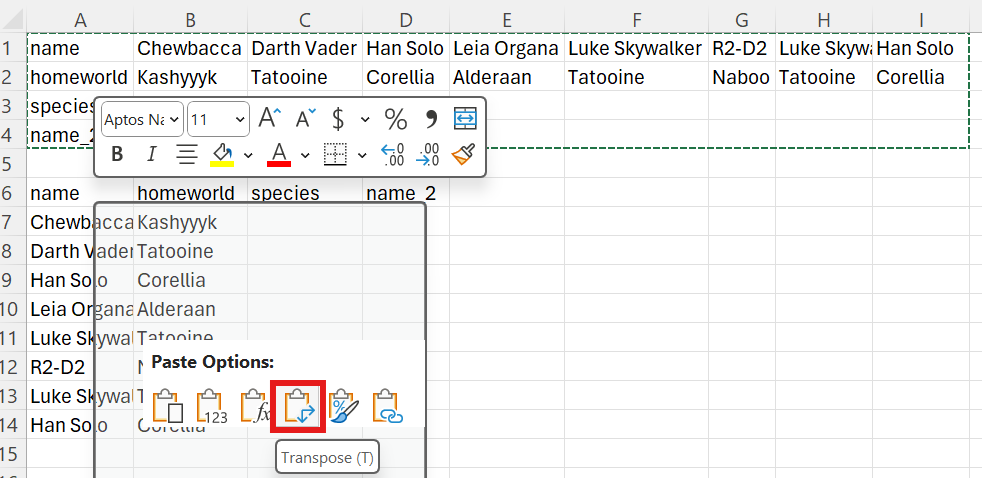

### 7.3 Delete un-transposed data
Let's delete the un-transposed data, so that the `name` column header is now in cell A1. 

The easiest way to do that is to select rows 1-5, right click, and delete:

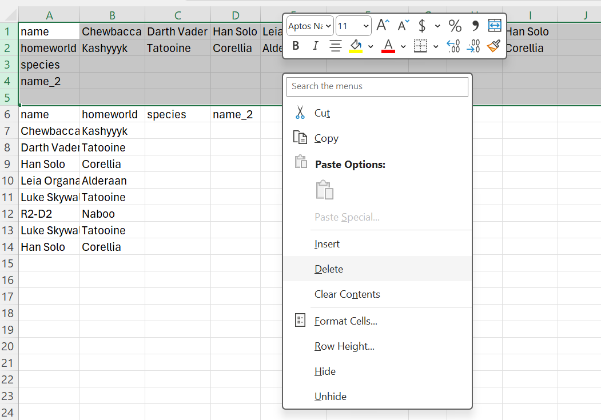

## 👥Step 8: Remove Duplicates
Under the Data tab, there's a useful feature called **Remove Duplicates**. 

As with filtering, however, *this tool can be very dangerous.*

Here's where **Highlight Duplicates** can be helpful:

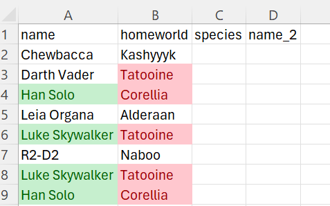

I've copied a few records, so there are a few true duplicates in both `name` and `homeworld`. 

However, both Darth Vader and Luke Skywalker have Tatooine as their homeworld. 

If we were to remove the duplicates from the `homeworld` column *only*, it would keep the first instance and drop all the rest. It would correctly remove the duplicated Han and Luke entries, but it would also drop Luke entirely. 

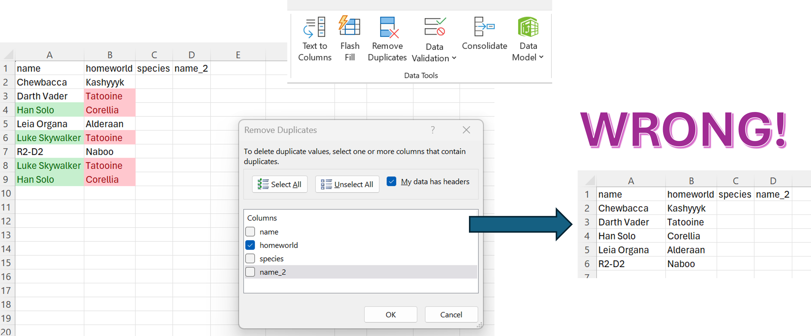

The correct way would be to either select only the `name` column, or to select all columns, which will evaluate for duplicate entries across all rows.

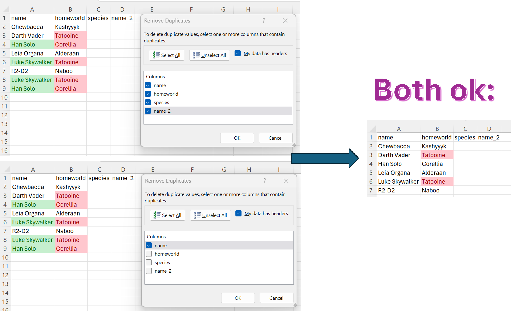

## 🔎Step 9: `VLOOKUP`
I'm  not exaggerating when I say my life changed dramatically (for the better) once I finally learned how to write a `VLOOKUP`. 

You'll notice that we have blank columns for `species` and a column I've called `name_2`. 

Using a `VLOOKUP`, I can match the unique `name` variable in `star_wars_homeworlds.xlsx` and `clean_star_wars.xlsx` to automatically populate the empty `species` and `name_2` columns. 

### 9.1 Writing a `VLOOKUP`
I say "writing," but I always use Excel's "Insert Function" tool.

#### 9.1.1 Insert the `VLOOKUP` function
Select the first blank cell we want to populate, C2. Click the function button: *fx*

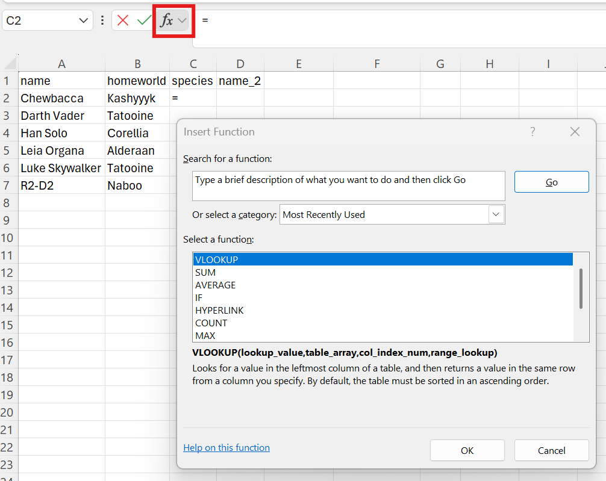

`VLOOKUP` is my most-used function, but you will have to search for it in the search box. 

Let's walk through how to populate each of the arguments in the `VLOOKUP` function:

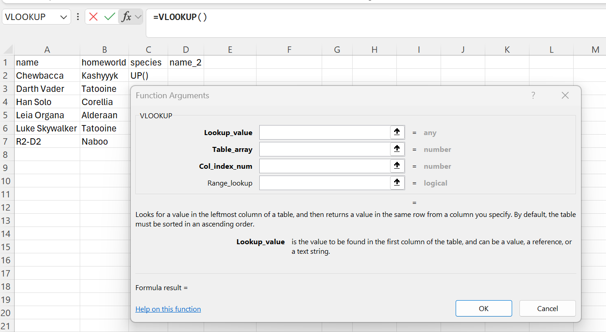

#### 9.1.2 Lookup_value
This is the unique key that you will use to match the data in your current sheet with the source data.

Here, we will use `name`. Since we are filling out the `VLOOKUP` for cell C2, we want to select the corresponding name in A2.

You can type "A2" or you can select the ⬆️ arrow next to **Lookup_value** and then click cell A2.

We will write this whole `VLOOKUP` function for cell C2, but I'll show you how to apply it to the rest of the empty cells. 

#### 9.1.3 Table_array
This is where the `VLOOKUP` is looking. Here we provide the range of data that includes both the unique key (here `name`) and the column containing the missing data we want to populate. 

Don't worry if you include extra data in this step, we will tell it specifically where to look later. 

The only requirement is that the unique key is in the **first column** of this array. This is how the `VLOOKUP` knows where our unique key is in the other dataset. 

To complete this, we should definitely select the ⬆️ and then move to the `clean_star_wars.xlsx` workbook. We will select from A1 through J7.

You'll notice that **Table_array** has now been populated with `[clean_star_wars.xlsx]clean_star_wars!$A$1:$J$7`.

This is how Excel knows which workbook to look in (here `clean_star_wars.xlsx`) for the data.

#### 9.1.4 Col_index_num
This is where we tell it the column we want to pull the data from; we tell it the specific *column* (col) *index number* (index_num).

Note that this is **in relation to the array from the previous step.**

If you started your **Table_array** on column Y of a spreadsheet, and wanted the data in column Z, you would write `2` because Z is the 2nd column in the array you provided, even though it's the 26th column in the overall spreadsheet. 

For us, `species` is in column 10 of our spreadsheet and our array from A1-J7, so we will write 10 here. 

#### 9.1.5 Range_lookup
This is basically asking if you want an exact match to your unique key or an approximation.

`TRUE` gives an approximation, `FALSE` gives an exact match. 

I have only ever used `FALSE` in my `VLOOKUP`s.

#### 9.1.6 Admire your work (and run your function)
Here is our beautiful `VLOOKUP` function!

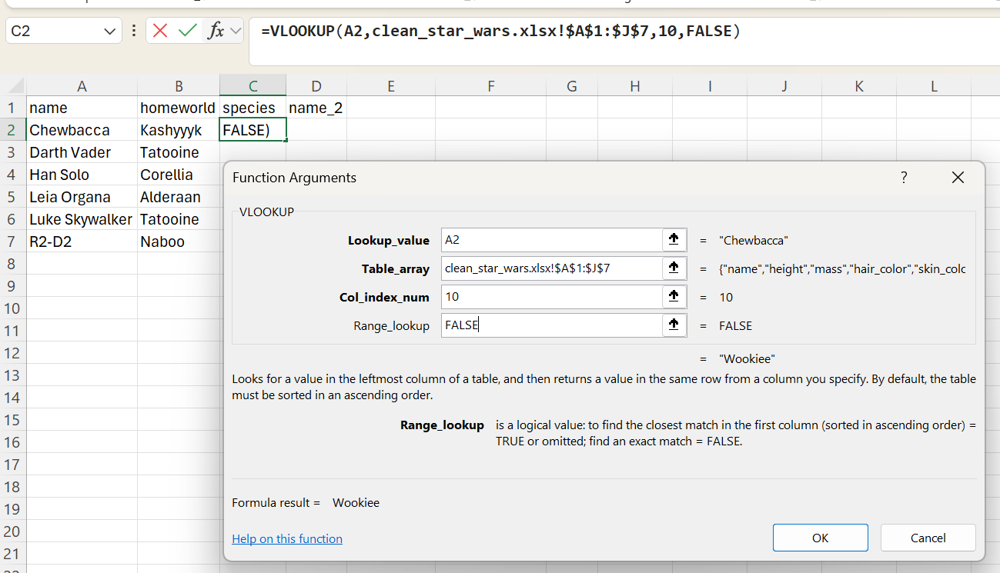

You can see it gives you a preview of the answer it will return -- you can see that it correctly says `= Wookiee`. Hit Ok to apply it to the cell. 

### 9.2 Applying a VLOOKUP to a range
Ok, phew, we wrote that whole `VLOOKUP` statement...just for cell C2. 

Please don't tell me I need to do that every time for every cell! (You may be saying)

Don't worry! I will show you how to apply it to the rest of your data. 

#### 9.2.1 Holding the name constant
You may have been wondering what the `$` were in the **Table_array** argument. 

A `$` tells Excel to hold something constant. When our **Table_array** said `$A$1:$J$7`, it means to always look from A1 to J7. It's keeping the range of data constant. 

We can do the same for our **Lookup_value**. In this row, A2 will always be our unique key, so we want to tell Excel that our **Lookup_value** should always be A2. 

But! We're going to apply our `VLOOKUP` to the other names in our spreadsheet, so we don't want to fix both the column *and* the row (`$A$2`), because then it would only ever return the result for the name value in A2 (Chewbacca).

We want to fix the name column, but allow the row to change, so we will change our **Lookup_value** to `$A2`.

Now, we can click the tiny square in the bottom right corner of cell C2 and drag it so that the `VLOOKUP` populates cells C2 to C7:

The **Lookup_value** should have automatically updated to correspond to each row.

We wrote all that to get `species`, but I also have this mysterious `name_2` column (the reason for this will become clear eventually). 

Here's how we can fix the unique ID in A2 so we can apply this same `VLOOKUP` to look for the corresponding `name` instead of `species`:
