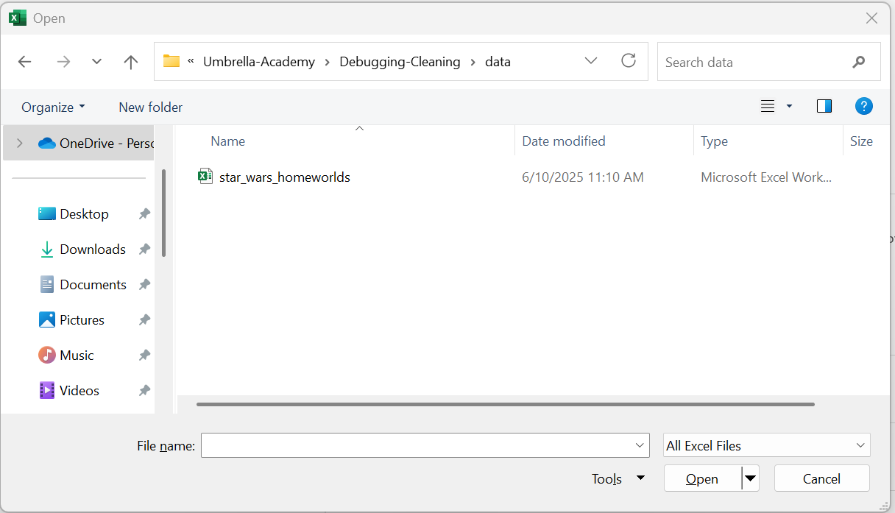
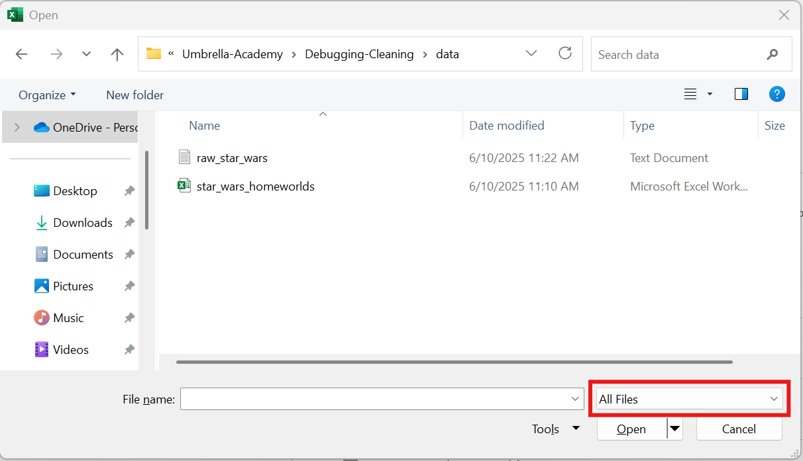
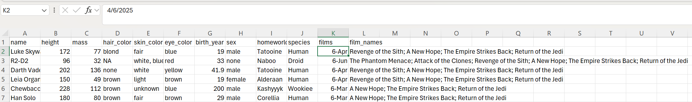
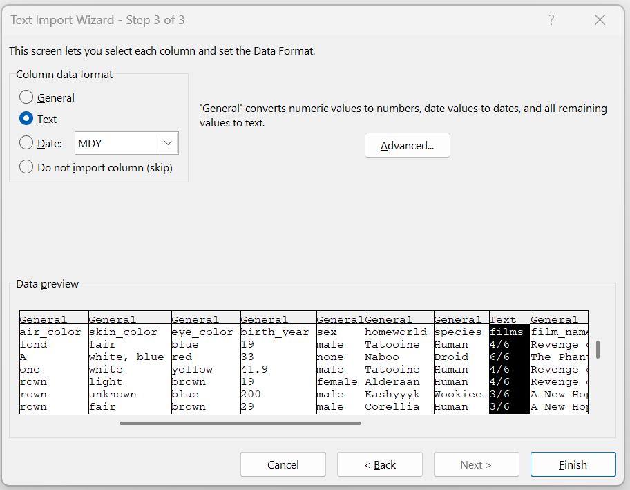
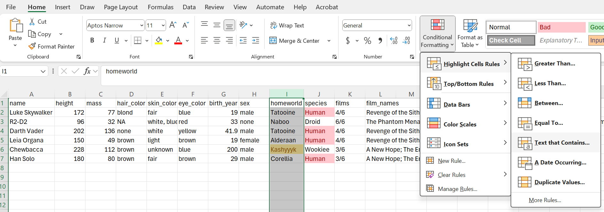

# Excel Tips and Tricks
This exercise will teach you a few of the most useful tips for data manipulation and cleaning in Excel. 

## ⤵️Step 1: Importing Data
One of the most annoying and detrimental features of Excel is how much it **loves** to convert data, especially fractions (➗), into dates (📅).

I've saved our test dataset as a `.txt` file to illustrate this.

### 1.1 Download [raw_star_wars.txt](data/raw_star_wars.txt).

Open Excel, select Open 📂, then Browse 📂 and navigate to your Downloads folder.

You will see something that looks like this, and you will ask yourself, "Where is the file that I literally just downloaded?"

You will then go to the dropdown in the bottom right and change it from "All Excel Files" to "All Files"

There it is! 

### 1.2 Import raw_star_wars.txt
Select the file and click Open. 

You'll see an Import Wizard 🪄

#### 1.2.1 Use the defaults for Step 1
The file is Delimited (not Fixed Width).

You *can* check "My data has headers."

#### 1.2.2 Use the defaults for Step 2
We can see now that the file is **Tab**-delimited because the columns are correctly separated when we select **Tab** as the delimiter. 

To prove this, try unchecking **Tab** and selecting one of the other delimiters. 

#### 1.2.3 What happens if we use the defaults for Step 3
I've made a column called `films` with how many films a character has appeared in, out of the original and prequel trilogies.

So Luke Skywalker (who technically appears as a baby in Revenge of the Sith, in addition to all the original movies) is in 4/6 films. 

But Excel has decided that 4/6 = April 6th, 2025:

#### 1.2.4 What to do instead for Step 3
You can see that the default for Column data format is **General**, which automatically converts "date values to dates." 

You might say, why would it assume that 4/6 is a date and not a fraction? To which I say, great question, I have no idea why this is the default. 

The fix is to select the `films` column and change it from **General** to **Text**.

Cells formatted as **Text** are displayed exactly as written.

So select **Text** on Step 3 of the Import Wizard and click Finish.

## 🎨Step 2: Conditional Formatting
There's a lot of fancy stuff you can do with conditional formatting, but I'll teach you the basics.

### 2.1 Highlight Duplicates
Highlight column J, `species`, and select the following Conditional Formatting options:

A useful real-world example is gene expression analysis, where you have two lists of differentially expressed genes and you want to quickly see the overlap. Paste one gene list below the other (separated by a cell) and highlight duplicates.

### 2.2 Highlight Text that contains...
Highlight column I, `homeworld`, select the following Conditional Formatting options, and then type `Kashyyyk` for Chewie's homeworld:

Useful if you have specific text that you want to quickly highlight.

